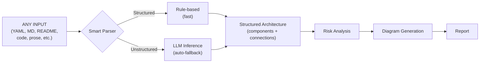
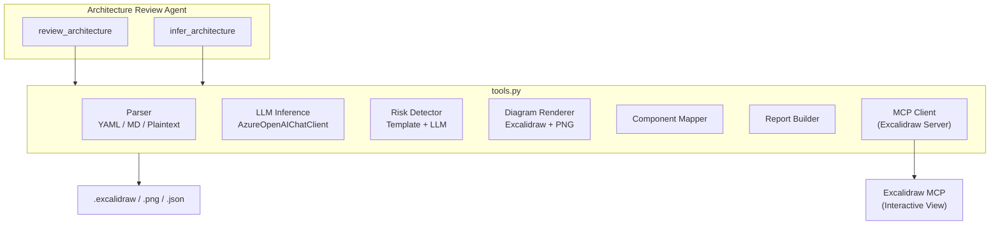

# Architecture Review Agent Sample

**AI-powered Architecture Reviewer & Diagram Generator Agent**

---

## What is the Architecture Review Agent?

The Architecture Review Agent is an open-source AI agent sample that **reviews software architectures and generates interactive diagrams** - automatically. Feed it any architectural description (YAML, Markdown, plain text, code, design docs) and it returns a structured review with risk analysis, actionable recommendations, and an [Excalidraw](https://excalidraw.com/) diagram you can edit and share.

### Why use it?

- **Instant architecture feedback** - get a prioritised risk assessment and improvement plan in seconds, not days.
- **Works with what you already have** - paste a YAML spec, drag in a README, or describe your system in plain English. The LLM infers structure when the input isn't formal.
- **Interactive diagrams** - auto-generated Excalidraw diagrams render components, connections, and data flows. Edit them in-browser or export to PNG.
- **Two deployment options** - run as a full-stack **Web App** (FastAPI + React) on Azure App Service, or as a **Hosted Agent** on Microsoft Foundry with Teams / M365 Copilot integration.
- **Built for developers** - runs locally with a single script, deploys to Azure with one command, and exposes a REST API for pipeline integration.

### Built with

| | |
|---|---|
| [Microsoft Agent Framework](https://github.com/microsoft/agents) | Hosted agent runtime for the Microsoft Foundry deployment path |
| [Excalidraw MCP Server](https://github.com/excalidraw/excalidraw-mcp) | Interactive diagram rendering via Model Context Protocol |
| [Azure OpenAI (GPT-4.1)](https://learn.microsoft.com/azure/ai-services/openai/) | LLM backend for architecture inference & risk analysis |
| [FastAPI](https://fastapi.tiangolo.com/) + [React](https://react.dev/) | Full-stack web app deployment path |

---

## Features

| Capability | Description |
|---|---|
| **Smart Input Intelligence** | Accepts **any** input - YAML, Markdown, plaintext arrows, READMEs, design docs, code, configs. LLM auto-infers architecture when format isn't structured |
| **Architecture Parsing** | Rule-based parsers for YAML, Markdown, plaintext; automatic LLM fallback for unstructured content |
| **Risk Detection** | Template-based detector for structured inputs; **LLM-generated** context-aware risks with 1-liner issues & recommendations when using inference |
| **Interactive Diagrams** | Renders architecture diagrams via Excalidraw MCP server for interactive viewing |
| **PNG Export** | High-resolution PNG output for docs, presentations, and offline sharing |
| **Component Mapping** | Dependency analysis with fan-in/fan-out metrics and orphan detection |
| **Structured Reports** | Executive summary, prioritised recommendations, and severity-grouped risk assessment |
| **Web UI** | React frontend with interactive Excalidraw diagrams, drag-and-drop file upload, risk tables, and downloadable outputs |
| **FastAPI Backend** | REST API exposing the full review pipeline - deployable to Azure App Service |
| **Hosted Agent** | Deploys as an OpenAI Responses-compatible API via Microsoft Agent Framework |

---

## Two Deployment Options

This sample ships with **two production deployment paths**. Both share the same core analysis engine ([tools.py](tools.py)) choose the one that fits your operational model.

### Option A - Web App (Azure App Service)

A traditional full-stack web application: **FastAPI** backend + **React** frontend, packaged in a single Docker image and deployed to **Azure App Service**.

- **You own the API surface** - custom REST endpoints (`/api/review`, `/api/infer`, etc.)
- **Interactive browser UI** - React + Excalidraw with drag-and-drop file upload, tabbed results, PNG/Excalidraw downloads
- **Standard App Service model** - bring-your-own infrastructure, scale via App Service Plan (manual or auto-scale rules)
- **Authentication** - API key or Azure AD, configured by you

**Best for:** Teams that want a **custom UI**, need to embed the API in existing tooling, or prefer full control over infrastructure and scaling.

**Key files:** [api.py](api.py) · [Dockerfile.web](Dockerfile.web) · [frontend/](frontend/) · [scripts/windows/deploy-webapp.ps1](scripts/windows/deploy-webapp.ps1)

### Option B - Hosted Agent (Microsoft Foundry Agent Service)

A **managed agent** deployed to Microsoft Foundry's Hosted Agent infrastructure via the **VS Code Foundry extension**. The platform handles containerisation, identity, scaling, and API compliance.

- **OpenAI Responses API** - your agent automatically exposes the OpenAI-compatible `/responses` endpoint
- **Managed infrastructure** - Microsoft Foundry builds, hosts, and scales the container (0 → 5 replicas, including scale-to-zero)
- **Managed identity** - no API keys in the container; the platform assigns a system-managed identity with RBAC
- **Conversation persistence** - the Foundry Agent Service manages conversation state across requests
- **Channel publishing** - publish your agent to **Microsoft Teams**, **Microsoft 365 Copilot**, a **Web App preview**, or a **stable API endpoint** - no extra code required
- **Observability** - built-in **OpenTelemetry** tracing with Azure Monitor integration
- **Stable deployment workflow** - the **VS Code Foundry extension** provides step-by-step guidance with automatic ACR integration, managed identity assignment, and built-in validation

**Best for:** Teams that want a **managed, scalable API** with zero infrastructure overhead, or need to publish the agent to **Teams / M365 Copilot** channels. The extension-based deployment flow is more reliable than script-based approaches and provides real-time feedback.

**Key files:** [main.py](main.py) · [agent.yaml](agent.yaml) · [Dockerfile](Dockerfile) · [deployment.md](deployment.md)

### Comparison

| | **Option A - Web App** | **Option B - Hosted Agent** |
|---|---|---|
| **Entry point** | [api.py](api.py) (FastAPI + Uvicorn) | [main.py](main.py) (Agent Framework) |
| **Container** | [Dockerfile.web](Dockerfile.web) (multi-stage Node + Python) | [Dockerfile](Dockerfile) (Python only) |
| **API style** | Custom REST (`/api/review`, `/api/infer`) | OpenAI Responses API (`/responses`) |
| **UI included** | Yes - React + Excalidraw | No (API only; use Foundry Playground or channels) |
| **Azure target** | Azure App Service + ACR | Microsoft Foundry Agent Service |
| **Scaling** | App Service Plan (manual / auto-scale rules) | Platform-managed (0–5 replicas, scale-to-zero) |
| **Identity** | Configured by you (API key, Azure AD) | System-assigned managed identity (automatic) |
| **Conversations** | Stateless REST (you manage state) | Platform-managed conversation persistence |
| **Channel publishing** | N/A (custom UI) | Teams, M365 Copilot, Web preview, stable endpoint |
| **Observability** | Add your own (App Insights, etc.) | Built-in OpenTelemetry + Azure Monitor |
| **Deployment** | Scripts: `.\scripts\windows\deploy-webapp.ps1` | VS Code Foundry extension |
| **Teardown** | `.\scripts\windows\teardown.ps1 -ResourceGroup <rg>` | Via Foundry portal |

> **Tip:** You can run both simultaneously use the Web App for your internal team's browser-based reviews, and the Hosted Agent for API consumers and Teams/Copilot integration.

---

## Project Structure

```
agent-architecture-review-sample/
├── main.py              # Hosted agent entry point (Microsoft Agent Framework)
├── api.py               # FastAPI backend (REST API for the web UI)
├── tools.py             # All tool logic (parser, risk detector, diagram renderer, MCP client, PNG export)
├── run_local.py         # CLI runner for local testing (no Azure required)
├── agent.yaml           # Foundry hosted agent deployment manifest
├── requirements.txt     # Python dependencies (pinned versions)
├── Dockerfile           # Container deployment (hosted agent)
├── Dockerfile.web       # Container deployment (web app - FastAPI + React)
├── deployment.md        # Step-by-step deployment & RBAC guide
├── .env.template        # Environment variable template
├── scripts/             # All automation scripts organized by OS
│   ├── README.md           # Script usage guide
│   ├── windows/            # PowerShell scripts for Windows
│   │   ├── setup.ps1       # One-click setup (Windows)
│   │   ├── dev.ps1         # Start dev servers (Windows)
│   │   ├── deploy-webapp.ps1  # Deploy web app to App Service
│   │   └── teardown.ps1    # Delete all Azure resources
│   └── linux-mac/          # Bash scripts for Linux/macOS
│       ├── setup.sh        # One-click setup (Unix)
│       ├── dev.sh          # Start dev servers (Unix)
│       ├── deploy-webapp.sh   # Deploy web app to App Service
│       └── teardown.sh     # Delete all Azure resources
├── frontend/            # React UI (Vite + Excalidraw)
│   ├── src/
│   │   ├── App.jsx      # Main app with input, tabs, and results
│   │   ├── api.js       # API client
│   │   └── components/  # Summary, RiskTable, ComponentMap, DiagramViewer, Recommendations
│   ├── vite.config.js   # Vite config with API proxy
│   └── package.json
├── examples/
│   ├── ecommerce.yaml   # Sample: 12-component e-commerce microservices
│   └── event_driven.md  # Sample: 8-component event-driven IoT pipeline
└── output/              # Generated outputs (auto-created)
    ├── architecture.excalidraw
    ├── architecture.png
    └── review_bundle.json
```

---

## Installation

### Prerequisites

- Python 3.11+
- (Optional) Azure OpenAI access for LLM inference & hosted agent mode

### Quick Setup (recommended)

Setup scripts are provided that create a `.venv` virtual environment, install all dependencies, and initialise the `.env` file in one step:

**Windows (PowerShell):**

```powershell
# Clone the repository
git clone https://github.com/Azure-Samples/agent-architecture-review-sample
cd agent-architecture-review-sample

# Run the setup script (creates .venv, installs deps, copies .env.template → .env)
.\scripts\windows\setup.ps1
```

**Linux / macOS (Bash):**

```bash
# Clone the repository
git clone https://github.com/Azure-Samples/agent-architecture-review-sample
cd agent-architecture-review-sample

# Run the setup script
chmod +x scripts/linux-mac/setup.sh
bash scripts/linux-mac/setup.sh
```

### Manual Setup

If you prefer to set things up manually:

```bash
# Clone the repository
git clone <repo-url>
cd agent-architecture-review-sample

# Create virtual environment
python -m venv .venv

# Activate virtual environment
# Windows (PowerShell):
.\.venv\Scripts\Activate.ps1
# Windows (cmd):
.\.venv\Scripts\activate.bat
# Linux/macOS:
source .venv/bin/activate

# Upgrade pip & install dependencies
python -m pip install --upgrade pip
pip install -r requirements.txt

# Create .env from template
cp .env.template .env   # then edit .env with your settings
```

### Environment Configuration

```bash
# Copy the template
cp .env.template .env
```

Edit `.env` with your settings:

```dotenv
# Microsoft Foundry / OpenAI Configuration
# Use PROJECT_ENDPOINT for Microsoft Foundry projects, or AZURE_OPENAI_ENDPOINT for Azure OpenAI
PROJECT_ENDPOINT=https://your-project.services.ai.azure.com/api/projects/your-project
AZURE_OPENAI_ENDPOINT=https://your-resource.openai.azure.com/
MODEL_DEPLOYMENT_NAME=gpt-4.1
AZURE_OPENAI_API_KEY="your-azure-openai-api-key"

# SSL: Set to "1" if behind a corporate proxy or experiencing SSL certificate errors
# ARCH_REVIEW_NO_SSL_VERIFY=1
```

> **Note:** The `ARCH_REVIEW_NO_SSL_VERIFY=1` flag disables SSL verification for the Excalidraw MCP server connection. Use this if you're behind a corporate proxy or firewall that intercepts HTTPS traffic. You can also set it inline:
>
> ```powershell
> # PowerShell
> $env:ARCH_REVIEW_NO_SSL_VERIFY="1"
> ```
>
> ```bash
> # Bash
> export ARCH_REVIEW_NO_SSL_VERIFY=1
> ```

---

## Usage

### Local CLI (no Azure required for structured inputs)

The local runner executes the full pipeline parse, risk analysis, diagram generation, component mapping, and structured report output.

```bash
# Analyse a YAML architecture file (rule-based parser)
python run_local.py examples/ecommerce.yaml

# Analyse a Markdown architecture file
python run_local.py examples/event_driven.md

# Inline plaintext (chained arrows supported)
python run_local.py --text "Load Balancer -> Web Server -> App Server -> PostgreSQL DB"

# With Excalidraw MCP server rendering (interactive diagram)
python run_local.py examples/ecommerce.yaml --render

# Feed ANY file - auto-falls back to LLM inference if not structured
python run_local.py README.md
python run_local.py design_doc.txt

# Force LLM inference (requires Azure OpenAI configured in .env)
python run_local.py some_readme.md --infer
python run_local.py --infer "We have a React frontend, Kong gateway, three microservices, and PostgreSQL"
python run_local.py --text "We have a React frontend, Kong gateway, three microservices, and PostgreSQL" --infer
```

**Outputs** (saved to `output/`):
- `architecture.excalidraw` - Excalidraw file for local viewing
- `architecture.png` - High-resolution PNG diagram
- `review_bundle.json` - Full structured review report (JSON)

### Option A - Web App (React + FastAPI)

The Architecture Review Agent includes a full-stack web interface with an interactive Excalidraw diagram viewer, risk tables, and component maps. See [Two Deployment Options](#two-deployment-options) for a comparison with Option B.

#### Quick Start (PowerShell)

```powershell
.\scripts\windows\dev.ps1
```

This starts the FastAPI backend on port **8000** and the Vite dev server on port **5173**.
Open [http://localhost:5173](http://localhost:5173) in your browser.

#### Manual Start

```bash
# Terminal 1 - Backend
python -m uvicorn api:app --reload --port 8000

# Terminal 2 - Frontend
cd frontend
npm install        # first time only
npx vite --port 5173
```

#### Docker (combined build)

```bash
docker build -f Dockerfile.web -t arch-review-web .
docker run -p 8000:8000 --env-file .env arch-review-web
```

Open [http://localhost:8000](http://localhost:8000) - the container serves both the API and the React UI.

#### Deploy to Azure App Service

Automated deployment scripts handle resource provisioning, container build, and configuration:

**PowerShell:**
```powershell
.\scripts\windows\deploy-webapp.ps1 -ResourceGroup arch-review-rg -AppName arch-review-web
```

**Bash:**
```bash
bash scripts/linux-mac/deploy-webapp.sh --resource-group arch-review-rg --app-name arch-review-web
```

The scripts create an Azure Container Registry, build the image via ACR Tasks,
provision an App Service Plan + Web App with managed identity, and configure
app settings from your `.env` file.

To tear down all resources:

**PowerShell:**
```powershell
.\scripts\windows\teardown.ps1 -ResourceGroup arch-review-rg
```

**Bash:**
```bash
bash scripts/linux-mac/teardown.sh --resource-group arch-review-rg
```

#### API Endpoints

| Method | Path | Description |
|--------|------|-------------|
| `POST` | `/api/review` | Submit architecture text for full review |
| `POST` | `/api/review/upload` | Upload a YAML/MD/TXT file |
| `POST` | `/api/infer` | Force LLM inference on free-form text |
| `GET`  | `/api/download/png/{run_id}` | Download PNG diagram |
| `GET`  | `/api/download/excalidraw/{run_id}` | Download Excalidraw JSON |
| `GET`  | `/api/health` | Health check |

### Option B - Hosted Agent (Microsoft Foundry Agent Service)

The hosted agent starts an **OpenAI Responses-compatible** API server. Locally it runs on port 8088; when deployed to Microsoft Foundry, the platform manages the endpoint, scaling, identity, and conversation state. See [Two Deployment Options](#two-deployment-options) for a comparison with Option A.

#### Local Testing

```bash
python main.py
# → Architecture Review Agent Server running on http://localhost:8088
```

Test with a curl / PowerShell request:

```powershell
Invoke-RestMethod -Uri "http://localhost:8088/responses" `
  -Method POST -ContentType "application/json" `
  -Body '{"input":{"messages":[{"role":"user","content":"Review: LB -> API -> DB"}]}}'
```

#### Docker

```bash
docker build -t arch-review .
docker run -p 8088:8088 --env-file .env arch-review
```

#### Deploy to Microsoft Foundry (VS Code Extension)

The **VS Code Foundry extension** provides the most stable and straightforward deployment workflow:

1. Install the [Microsoft Foundry for VS Code extension](https://marketplace.visualstudio.com/items?itemName=TeamsDevApp.vscode-ai-foundry)
2. Open the Command Palette (`Ctrl+Shift+P`) and run **`Microsoft Foundry: Deploy Hosted Agent`**
3. Select your Foundry workspace and follow the prompts
4. The extension handles ACR build, container deployment, and managed identity assignment automatically

See [deployment.md](deployment.md) for the complete step-by-step guide with screenshots and RBAC configuration.

#### What Microsoft Foundry Provides

Once deployed as a hosted agent, the platform manages:

| Capability | Details |
|---|---|
| **Container hosting** | Built via ACR Tasks, deployed to Foundry-managed compute |
| **Auto-scaling** | 0 → 5 replicas with scale-to-zero support |
| **Managed identity** | System-assigned identity with RBAC - no API keys in the container |
| **Conversation persistence** | The Foundry Agent Service stores and manages conversation state |
| **Channel publishing** | Publish to **Microsoft Teams**, **M365 Copilot**, **Web App preview**, or a **stable API endpoint** |
| **Observability** | Built-in OpenTelemetry tracing integrated with Azure Monitor |
| **API compliance** | Automatic OpenAI Responses API endpoint |

#### Testing the Deployed Agent

**Foundry Playground (VS Code):** Open the Foundry extension → **Hosted Agents (Preview)** → **Architecture Review Agent** → **Playground** tab.

**REST API:**
```powershell
$endpoint = "https://<your-resource>.services.ai.azure.com/api/projects/<your-project>"
$token = (az account get-access-token --resource "https://cognitiveservices.azure.com" --query accessToken -o tsv)

Invoke-RestMethod `
  -Uri "$endpoint/openai/responses?api-version=2025-05-15-preview" `
  -Method POST `
  -Headers @{ "Authorization" = "Bearer $token"; "Content-Type" = "application/json" } `
  -Body (@{ input = @{ messages = @(@{ role = "user"; content = "Review: LB -> API -> Cache -> DB" }) } } | ConvertTo-Json -Depth 5)
```

> [!IMPORTANT]
> For the full deployment guide including RBAC setup, VS Code Foundry Extension workflow, and troubleshooting, see [deployment.md](deployment.md).

For official Microsoft documentation, see [Hosted Agents documentation](https://learn.microsoft.com/en-us/azure/ai-foundry/agents/concepts/hosted-agents?view=foundry&tabs=cli).

### Model Deployment (Azure OpenAI)

This sample requires a deployed model (GPT-4.1 recommended) on Azure OpenAI or Microsoft Foundry.

#### Option 1: Microsoft Foundry (recommended)

1. Go to [Microsoft Foundry](https://ai.azure.com) and create or open a project.
2. Navigate to **Models + endpoints** → **Deploy model** → **Deploy base model**.
3. Select **gpt-4.1** (or your preferred model) and click **Deploy**.
4. Copy the **Project endpoint** (e.g., `https://<project>.services.ai.azure.com`).
5. Note the **Deployment name** (e.g., `gpt-4.1`).
6. Set the environment variables:

```dotenv
PROJECT_ENDPOINT=https://<your-project>.services.ai.azure.com
MODEL_DEPLOYMENT_NAME=gpt-4.1
```

#### Option 2: Azure OpenAI

1. In the [Azure Portal](https://portal.azure.com), create an **Azure OpenAI** resource.
2. Go to **Microsoft Foundry** → select the resource → **Deployments** → **Create deployment**.
3. Choose **gpt-4.1**, set the deployment name, and deploy.
4. Copy the **Endpoint** (e.g., `https://<resource>.openai.azure.com/`).
5. Set the environment variables:

```dotenv
AZURE_OPENAI_ENDPOINT=https://<your-resource>.openai.azure.com/
AZURE_AI_MODEL_DEPLOYMENT_NAME=gpt-4.1
```

#### Authentication

The Architecture Review Agent supports two authentication methods:

1. **API Key** (simplest) - Set `AZURE_OPENAI_API_KEY` in `.env`. Used automatically when present.
2. **DefaultAzureCredential** (fallback) - Supports Azure CLI (`az login`), Managed Identity, and service principal env vars (`AZURE_CLIENT_ID` / `AZURE_TENANT_ID` / `AZURE_CLIENT_SECRET`).

For local development with API key:

```dotenv
AZURE_OPENAI_ENDPOINT=https://your-resource.openai.azure.com/
AZURE_OPENAI_API_KEY=your-key-here
```

Or with Azure CLI:

```bash
az login
az account set --subscription <your-subscription-id>
```

---

## Input Formats

The Architecture Review Agent accepts **any** input - structured or unstructured.  Component names, types, and architectures are fully dynamic.

### How it works



1. **Structured formats** (YAML with `components`/`connections`, Markdown with `## Components` headers, plaintext arrows) → fast rule-based parser.
2. **Unstructured inputs** (any other file, prose, code, config) → when rule-based parsing yields ≤1 component, the LLM automatically analyses the content, infers components/types/connections, and proceeds.
3. **Force LLM** → use `--infer` flag to always use LLM inference, even on structured inputs.

### Structured: YAML

```yaml
name: My Architecture
components:
  - name: API Gateway
    type: gateway
    technology: Kong
    replicas: 2
  - name: User Service
    type: service
    replicas: 3
  - name: User Database
    type: database
    technology: PostgreSQL

connections:
  - from: api_gateway
    to: user_service
    protocol: REST
  - from: user_service
    to: user_database
    protocol: TCP
```

Accepted keys: `components`/`services`/`nodes` and `connections`/`edges`/`flows`/`links`.

### Structured: Markdown

```markdown
## Components

### API Gateway
- **Type:** gateway
- **Technology:** Kong
- **Replicas:** 2

### User Service
- Handles user authentication and profiles

## Connections
- API Gateway -> User Service (REST)
- User Service -> User Database (TCP)
```

### Structured: Plaintext

```
API Gateway -> User Service -> User Database
API Gateway -> Product Service -> Product DB
Product Service -> Redis Cache
```

Chained arrows (`A -> B -> C`) are auto-expanded into individual connections.

### Unstructured: Anything Else

Feed it a README, design document, code file, Terraform config, meeting notes - the LLM analyses it:

```text
Our platform uses React for the frontend, served through CloudFront CDN.
All API calls go through a Kong API Gateway which routes to three microservices:
User Service, Order Service, and Inventory Service. Each service has its own
PostgreSQL database. Order Service publishes events to a Kafka topic that
Inventory Service consumes. We use Redis for session caching and Datadog
for monitoring.
```

The model will infer:
- **10 components** - React Frontend, CloudFront CDN, Kong API Gateway, User Service, Order Service, Inventory Service, 3× PostgreSQL DBs, Kafka, Redis, Datadog
- **Component types** - frontend, cache, gateway, service, database, queue, monitoring
- **~12 connections** - Frontend→CDN→Gateway→Services→DBs, Order→Kafka→Inventory, etc.

Then proceeds with full risk analysis, diagram generation, and report.

---

## Agent Tools

| Tool | Description |
|---|---|
| `review_architecture` | **One-call pipeline** - smart-parse (with automatic LLM fallback) → risk analysis → diagram + Excalidraw MCP render + PNG export → component map → structured report with executive summary and prioritised recommendations |
| `infer_architecture` | **LLM inference only** - extract components, types, and connections from any unstructured text (README, code, design doc, prose) without running the full review pipeline |

---

## Risk Detection

The Architecture Review Agent uses two risk engines depending on the parsing path:

### Template-based (rule-based inputs)

Fast pattern-matching across four categories:

| Category | What it detects |
|---|---|
| **SPOF** | Components with 1 replica and ≥2 dependants, or infrastructure types (gateway, database, cache, queue) with no redundancy |
| **Scalability** | Shared resources (cache, database, queue) used by ≥3 services - contention risk |
| **Security** | Frontend-to-database direct access, missing API gateway, external dependencies without circuit-breakers |
| **Anti-patterns** | Shared database pattern - multiple services writing to the same datastore |

### LLM-generated (inferred inputs)

When the LLM infers the architecture (auto-fallback or `--infer`), it also produces **context-aware risks** with concise 1-liner issues and actionable recommendations - covering SPOFs, redundancy gaps, security concerns, observability, compliance (e.g. PCI DSS), and architecture-specific bottlenecks.

Risks are severity-bucketed: `critical` → `high` → `medium` → `low`.

---

## Component Type Detection

When types aren't explicitly set, the Architecture Review Agent infers them from component names:

| Type | Keywords | Diagram Colour |
|---|---|---|
| database | database, db, mysql, postgres, mongodb, cosmos... | Yellow |
| cache | cache, redis, memcached, cdn | Orange |
| queue | queue, kafka, rabbitmq, sqs, event hub, pubsub... | Purple |
| gateway | gateway, load balancer, nginx, envoy, ingress | Violet |
| frontend | frontend, ui, spa, react, angular, vue, web app | Blue |
| storage | storage, s3, blob, bucket, file | Green |
| external | external, third-party, stripe, twilio | Red |
| monitoring | monitor, logging, prometheus, grafana, datadog | Grey |
| service | *(default for anything else)* | Green |

---

## Architecture



---

## Tech Stack

- **Microsoft Agent Framework** (`azure-ai-agentserver-agentframework`) - Hosted agent runtime
- **Excalidraw MCP Server** - Interactive diagram rendering via MCP protocol
- **Azure OpenAI** - LLM backend (GPT-4.1 recommended) via `AzureOpenAIChatClient` (API key or `DefaultAzureCredential`)
- **Pillow** - PNG diagram export
- **PyYAML** - YAML parsing
- **Rich** - CLI output formatting

---

## License

MIT
